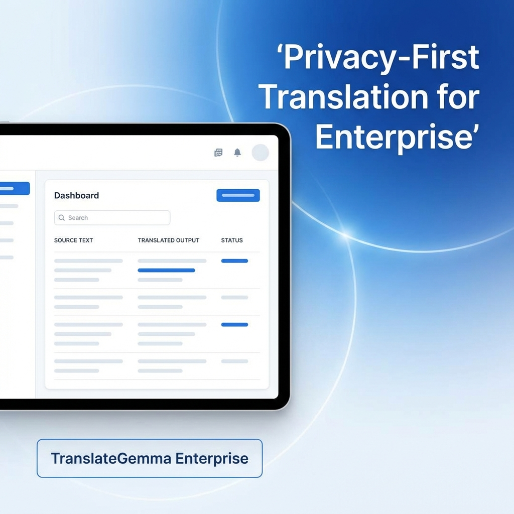
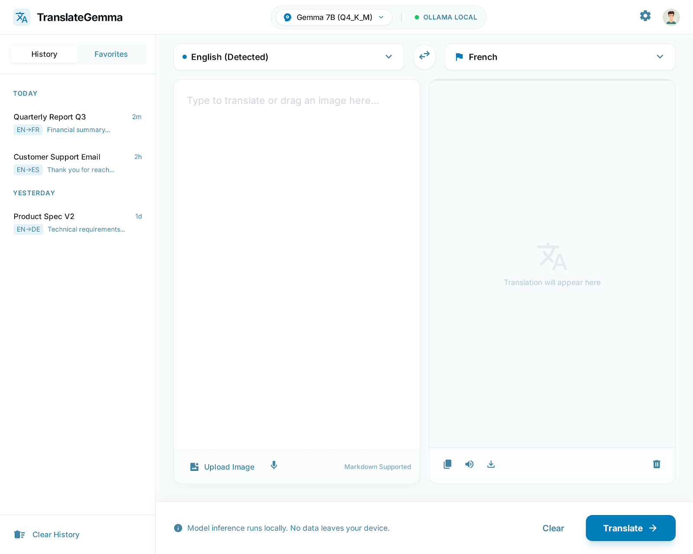
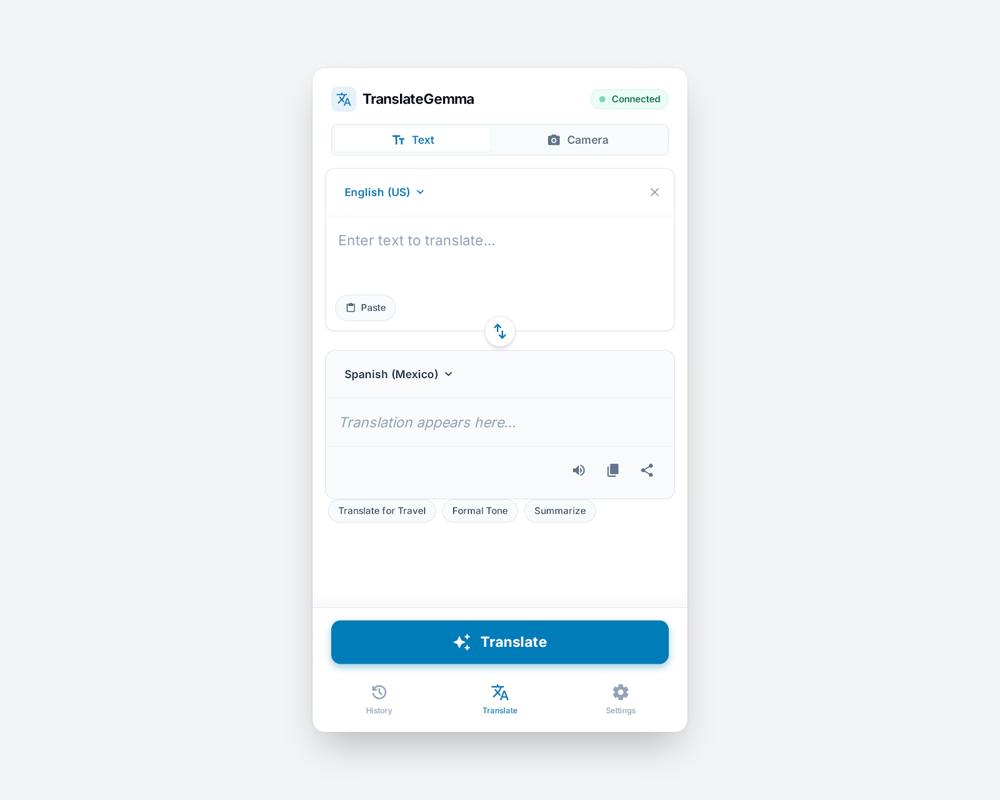
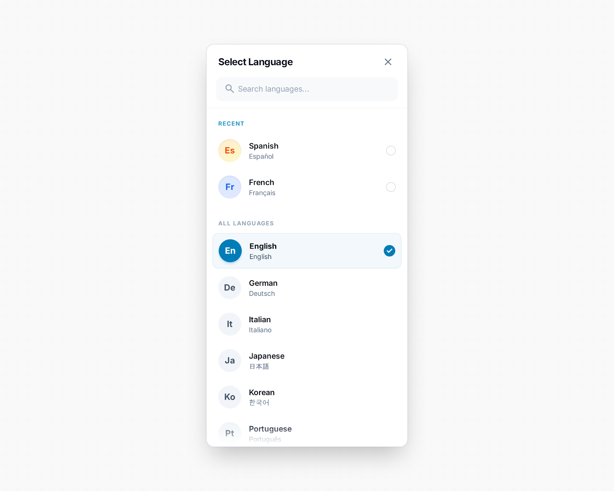
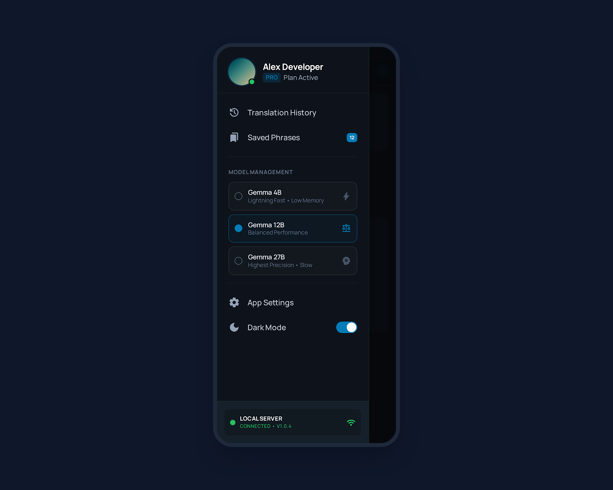

# TranslateGemma UI

<div align="center">
  

  <br />

  <!-- Badges -->
  
  
  
  

  <br />
  <br />

  <p align="center">
    <strong>Interfaz moderna y privada para los modelos de traducción de Google DeepMind.</strong>
    <br />
    Sin internet. Sin fugas de datos. 55 idiomas.
    <br />
    <br />
    <a href="#-inicio-rápido">Inicio Rápido</a> •
    <a href="docs/translategemma/README.md">Documentación</a> •
    <a href="https://translate.alexanderoviedofadul.dev">Live Demo</a> •
    <a href="#-galería">Galería Visual</a>
  </p>
</div>

---

## ⚡ ¿Qué es TranslateGemma UI?

**TranslateGemma UI** es la interfaz visual definitiva para interactuar con la nueva familia de modelos **TranslateGemma** (construidos sobre Gemma 3). Diseñada para ofrecer una experiencia similar a las herramientas comerciales en la nube, pero ejecutándose **100% localmente** en tu hardware.

Ideal para:
*   🏢 **Empresas** que manejan documentación sensible.
*   ✈️ **Viajeros** sin conexión a internet.
*   💻 **Desarrolladores** que integran traducción en sus flujos locales.

---

## ✨ Características Principales

| Característica | Descripción |
| :--- | :--- |
| 🌍 **55 Idiomas** | Soporte global impulsado por los modelos Gemma 3 de DeepMind. |
| 🔒 **100% Privado** | Tus datos nunca salen de tu dispositivo. Inferencia local con Ollama. |
| 🖼️ **Multimodal** | Arrastra y suelta imágenes para traducir texto dentro de ellas. |
| ⚡ **Rendimiento Flexible** | Elige entre modelos 4B (rápido), 12B (balanceado) o 27B (preciso). |
| 📱 **Diseño Adaptativo** | Experiencia fluida en Desktop, Tablet y Móvil. |

---

## 🎨 Galería

### Dashboard Principal
La potencia de la traducción profesional en un diseño minimalista.


### Experiencia Móvil
Lleva 55 idiomas en tu bolsillo.
<div align="center">
  
  
  
</div>

### Configuración de Modelos
Gestiona tus modelos LLM locales fácilmente.


---

## 🚀 Inicio Rápido

### Prerrequisitos

1.  Tener **[Ollama](https://ollama.com/)** instalado (o Docker).
2.  Tener al menos 8GB de RAM (para el modelo 4B/12B).
3.  Node.js >= 20 (para desarrollo).

### Instalación con Docker (Recomendado)

```bash
# 1. Clonar el repositorio
git clone https://github.com/bladealex9848/TranslateGemma-UI.git
cd TranslateGemma-UI

# 2. Iniciar todos los servicios (Frontend + Ollama + PocketBase)
docker compose up -d

# 3. Descargar el modelo de traducción (Esperar a que Ollama inicie)
docker exec -it translategemma-ui-ollama-1 ollama pull translategemma:latest

# 4. Acceder a la aplicación
open http://localhost:3000
```

### Desarrollo Local

```bash
# 1. Clonar e instalar dependencias
git clone https://github.com/bladealex9848/TranslateGemma-UI.git
cd TranslateGemma-UI/frontend
npm install

# 2. Configurar entorno
cp .env.local.example .env.local
# Editar .env.local con tus URLs de Ollama y PocketBase

# 3. Iniciar servidor de desarrollo
npm run dev

# 4. Abrir http://localhost:3000
```

---

## 📚 Documentación Técnica

Todo lo que necesitas saber sobre los modelos y la integración:

*   📖 **[Guía de Modelos](./docs/translategemma/MODELS.md)**: Comparativa de rendimiento 4B vs 12B vs 27B.
*   🗣️ **[Lista de Idiomas](./docs/translategemma/LANGUAGES.md)**: Todos los códigos ISO soportados.
*   🤖 **[Guía de Prompts](./docs/translategemma/PROMPT_GUIDE.md)**: Cómo hablar con el modelo vía API.
*   📱 **[Análisis de Diseño UI](./docs/UI_DESIGN_COMPLIANCE_ANALYSIS.md)**: Desglose completo de la interfaz.
*   🗺️ **[Roadmap de Implementación](./docs/IMPLEMENTATION_ROADMAP.md)**: Estado actual del desarrollo.

---

## 🛠️ Arquitectura

El proyecto utiliza una arquitectura moderna y desacoplada:

| Capa | Tecnología | Versión |
| :--- | :--- | :--- |
| **Frontend** | Next.js + React + TypeScript | 16.x / 19.x |
| **Styling** | Tailwind CSS | 4.x |
| **State** | Zustand | 5.x |
| **Backend/Auth** | PocketBase | 0.24+ |
| **LLM Runtime** | Ollama | Latest |
| **Modelos** | TranslateGemma (Google DeepMind) | 4B/12B/27B |

---

## 🤝 Contribuir

¡Las contribuciones son bienvenidas! Especialmente en:
*   Traducción de la interfaz.
*   Optimización de prompts para casos de borde.
*   Adaptadores para nuevos modelos.

---

<div align="center">
  <sub>Desarrollado con ❤️ para la comunidad Open Source.</sub>
</div>
