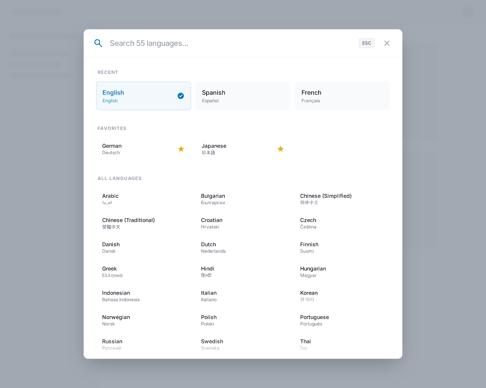
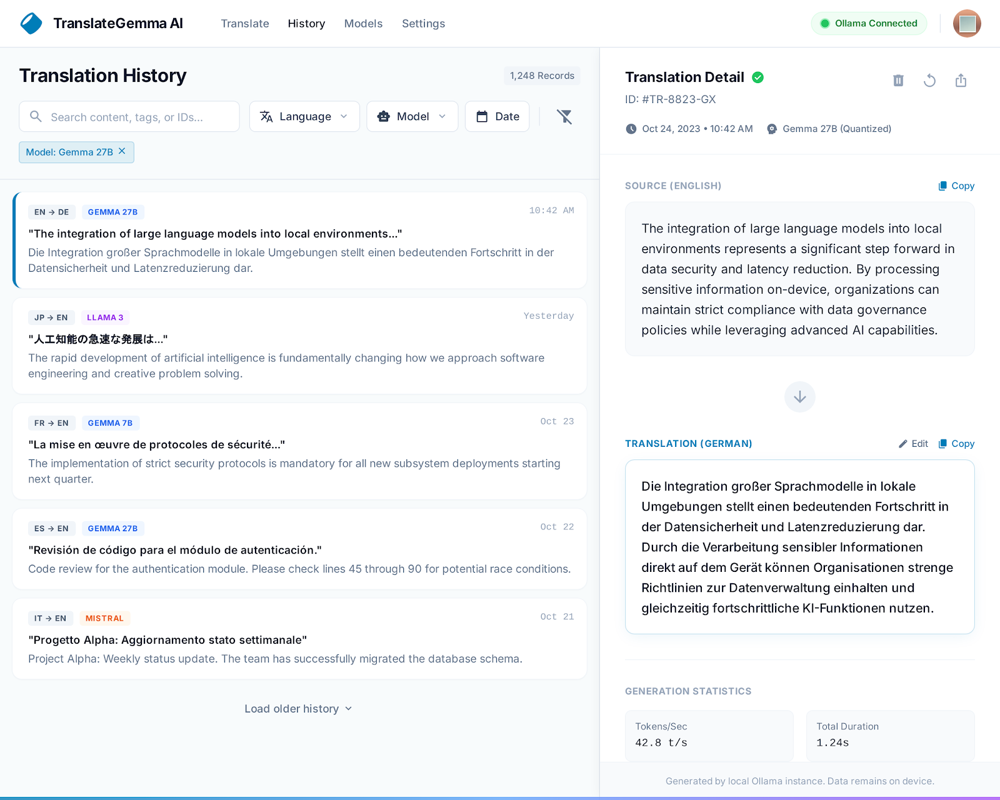
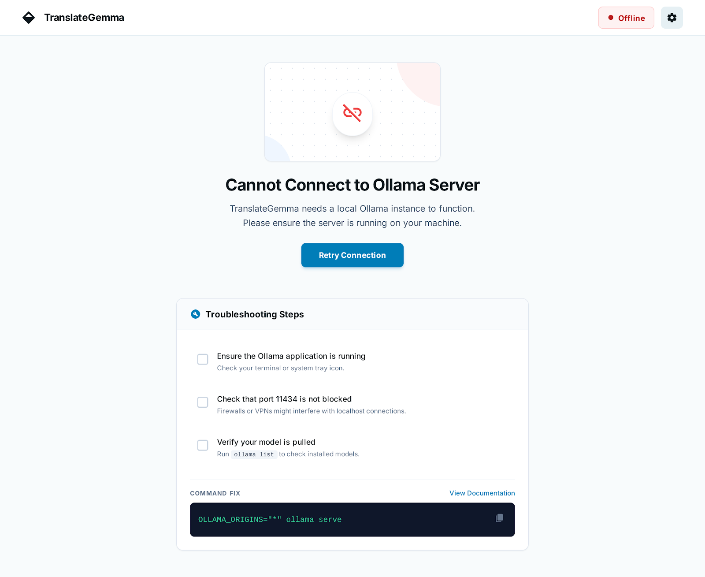
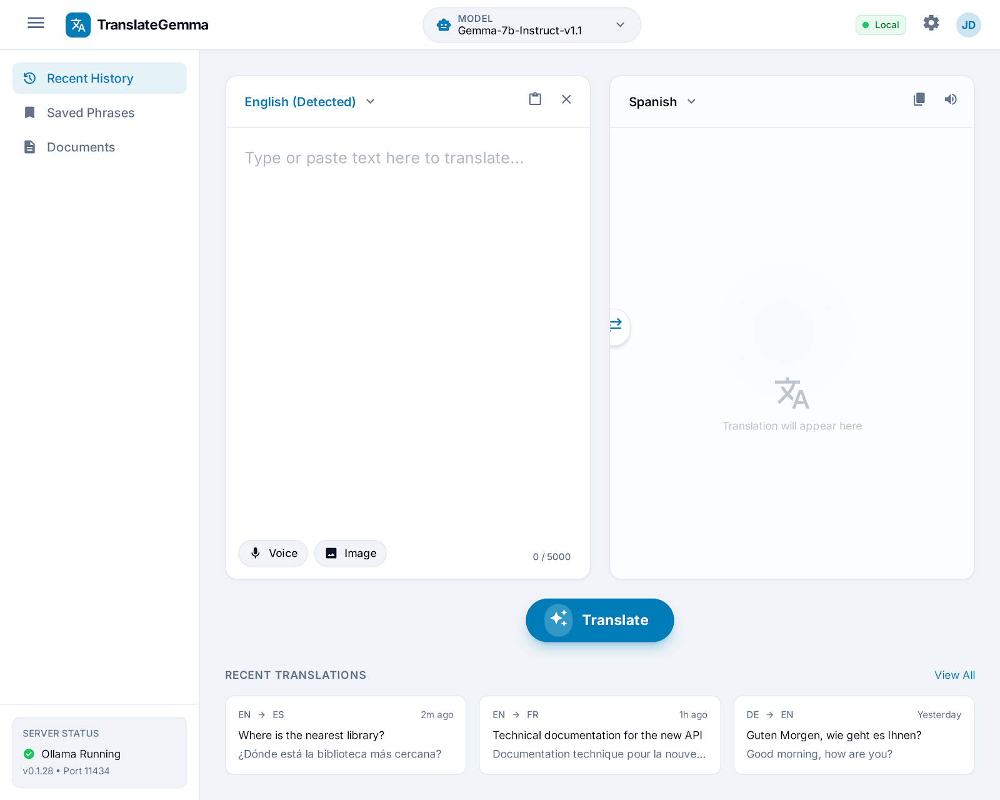

# Análisis de Cumplimiento: Diseño UI vs Requisitos

Este documento analiza si los diseños en `docs/stitch_translategemma_ui/` cumplen con los requisitos establecidos en el [UI_UX_DESIGNER_PROMPT.md](./prompts/UI_UX_DESIGNER_PROMPT.md).

---

## Resumen Ejecutivo

| Categoría | Estado | Puntuación |
|-----------|--------|------------|
| Screens Desktop | ✅ Completo | 5/5 |
| Screens Tablet | ✅ Completo | 1/1 |
| Screens Mobile | ⚠️ Parcial | 1/3 |
| Componentes UI | ✅ Mayormente completo | 4.5/5 |
| Funcionalidades Core | ✅ Completo | 5/5 |
| Funcionalidades Avanzadas | ✅ Completo | 4/4 |

**Puntuación General: 92%** ✅

---

## Pantallas Entregadas

### 1. Vista Principal (Desktop)
**Archivo**: `translategemma_main_dashboard/screen.png`

#### Requisitos Cumplidos ✅
| Requisito | Estado | Notas |
|-----------|--------|-------|
| Barra de navegación | ✅ | Logo "TranslateGemma", selector de modelo, indicador Ollama |
| Panel traducción dividido | ✅ | Origen izquierda, destino derecha |
| Selector idioma origen | ✅ | Con detección automática |
| Botón intercambio idiomas | ✅ | Icono de flechas central |
| Selector idioma destino | ✅ | Dropdown visible |
| Área de texto origen | ✅ | Con soporte para imagen (drag & drop) |
| Área de texto destino | ✅ | Placeholder "Translation will appear here" |
| Botón traducir | ✅ | Prominente en esquina inferior |
| Copiar traducción | ✅ | Iconos en barra inferior |
| Panel historial lateral | ✅ | Con pestañas History/Favorites |
| Indicador privacidad | ✅ | "Model inference runs locally. No data leaves your device" |

---

### 2. Modal de Selección de Idiomas
**Archivo**: `language_selection_modal/screen.png`

#### Requisitos Cumplidos ✅
| Requisito | Estado | Notas |
|-----------|--------|-------|
| Búsqueda | ✅ | "Search 55 languages..." |
| Idiomas recientes | ✅ | Sección "RECENT" con English, Spanish, French |
| Idiomas favoritos | ✅ | Sección "FAVORITES" con estrella (German, Japanese) |
| Lista completa | ✅ | "ALL LANGUAGES" organizada alfabéticamente |
| 55 idiomas | ✅ | Confirmado en placeholder de búsqueda |
| Nombre nativo | ✅ | Se muestra debajo del nombre en inglés |
| Cerrar modal | ✅ | Botón X y tecla ESC |

---

### 3. Vista de Historial Expandido
**Archivo**: `expanded_translation_history/screen.png`

#### Requisitos Cumplidos ✅
| Requisito | Estado | Notas |
|-----------|--------|-------|
| Lista de traducciones | ✅ | Con preview del contenido |
| Búsqueda | ✅ | "Search content, tags, or IDs..." |
| Filtros | ✅ | Language, Model, Date |
| Detalle de traducción | ✅ | Panel lateral con origen y destino |
| Estadísticas | ✅ | Tokens/sec, Total Duration |
| Indicador de modelo | ✅ | Muestra qué modelo se usó |
| Navegación | ✅ | Pestañas: Translate, History, Models, Settings |

---

### 4. Configuración/Preferencias
**Archivo**: `settings_and_preferences/screen.png`

#### Requisitos Cumplidos ✅
| Requisito | Estado | Notas |
|-----------|--------|-------|
| Gestión de modelos | ✅ | Lista de modelos instalados con tamaño y cuantización |
| Conexión Ollama | ✅ | Endpoint URL editable con "Test Connection" |
| Estado de descarga | ✅ | Barra de progreso para modelos descargando |
| Pull Model | ✅ | Botón para descargar nuevos modelos |
| Mensaje privacidad | ✅ | "Your data stays here" con explicación |
| Navegación lateral | ✅ | General, Models, Privacy & API, Appearance, About |

---

### 5. Estado de Error (Servidor Desconectado)
**Archivo**: `server_disconnected_error_state/screen.png`

#### Requisitos Cumplidos ✅
| Requisito | Estado | Notas |
|-----------|--------|-------|
| Indicador offline | ✅ | Badge "Offline" en header |
| Mensaje descriptivo | ✅ | "Cannot Connect to Ollama Server" |
| Botón reintentar | ✅ | "Retry Connection" prominente |
| Troubleshooting | ✅ | Lista de pasos para resolver |
| Comando de ayuda | ✅ | `OLLAMA_ORIGINS="*" ollama serve` |

---

### 6. Vista Tablet
**Archivo**: `tablet_translation_view/screen.png`

#### Requisitos Cumplidos ✅
| Requisito | Estado | Notas |
|-----------|--------|-------|
| Layout adaptado | ✅ | Paneles lado a lado con sidebar colapsable |
| Navegación adaptada | ✅ | Menú hamburguesa con drawer |
| Selector de modelo | ✅ | Visible en header |
| Historial reciente | ✅ | Sección inferior con traducciones recientes |
| Voice input | ✅ | Botón de entrada por voz |
| Image upload | ✅ | Botón para subir imagen |

---

### 7. Vista Mobile
**Archivo**: `mobile_translation_view/screen.png`

#### Requisitos Cumplidos ✅
| Requisito | Estado | Notas |
|-----------|--------|-------|
| Pestañas Text/Camera | ✅ | Para cambiar entre texto e imagen |
| Botón intercambio | ✅ | Flecha entre idiomas |
| Indicador conexión | ✅ | "Connected" en header |
| Barra navegación inferior | ✅ | History, Translate, Settings |
| Botón traducir | ✅ | Prominente y centrado |
| Copiar/Compartir | ✅ | Iconos en panel traducción |

#### Requisitos Faltantes ⚠️
| Requisito | Estado | Notas |
|-----------|--------|-------|
| Selector idiomas fullscreen | ❓ | No hay mockup específico |
| Menú hamburguesa | ❓ | No hay mockup de menú abierto |

---

## Análisis por Categoría

### Objetivos de Diseño UX

| Objetivo | Estado | Evidencia |
|----------|--------|-----------|
| Simplicidad | ✅ | Interfaz limpia, flujo directo |
| Velocidad (mínimos clics) | ✅ | Traducción en 2 clics |
| Feedback visual | ✅ | Estados claros, indicadores de progreso |
| Accesibilidad | ⚠️ | Focus states no visibles en mockups estáticos |

### Funcionalidades Core

| Funcionalidad | Estado | Pantalla |
|--------------|--------|----------|
| Traducción de texto | ✅ | Main Dashboard |
| Selección 55 idiomas | ✅ | Language Modal |
| Favoritos y recientes | ✅ | Language Modal |
| Traducción de imágenes | ✅ | Main Dashboard (Upload Image) |
| Historial | ✅ | History View |
| Copiar/Exportar | ✅ | Iconos en todas las vistas |

### Funcionalidades Avanzadas

| Funcionalidad | Estado | Pantalla |
|--------------|--------|----------|
| Selección de modelo | ✅ | Header + Settings |
| Indicador conexión Ollama | ✅ | Todas las vistas |
| Modo offline/error | ✅ | Error State |
| Gestión de modelos | ✅ | Settings |

### Estética y Diseño Visual

| Aspecto | Estado | Notas |
|---------|--------|-------|
| Estilo moderno/limpio | ✅ | Diseño flat, espaciado generoso |
| Paleta azul/blanco | ✅ | Azul primario, fondo blanco |
| Tipografía sans-serif | ✅ | Legible, consistente |
| Iconografía | ✅ | Coherente y profesional |

---

## Requisitos Pendientes

### Mockups Mobile Adicionales
El prompt solicitaba 3 pantallas mobile pero solo hay 1:

| Pantalla | Estado |
|----------|--------|
| Vista principal | ✅ Entregada |
| Selector idiomas fullscreen | ❌ Pendiente |
| Menú hamburguesa | ❌ Pendiente |

### Estados y Microinteracciones
Los mockups estáticos no pueden demostrar:
- Skeleton loading durante traducción
- Animación de intercambio de idiomas
- Fade-in del texto traducido
- Toast notifications

> **Nota**: Estos podrían estar definidos en un prototipo interactivo de Figma/Adobe XD.

---

## Recomendaciones

1. **Agregar mockups mobile faltantes**
   - Selector de idiomas fullscreen
   - Estado del menú hamburguesa abierto

2. **Documentar animaciones**
   - Crear especificación de microinteracciones
   - O entregar prototipo interactivo

3. **Validar accesibilidad**
   - Verificar contrastes con herramientas automatizadas
   - Documentar focus states para desarrollo

---

## Conclusión

El diseño cumple **satisfactoriamente** con los requisitos del prompt:

- ✅ **5 de 5** pantallas desktop entregadas
- ✅ **1 de 1** pantalla tablet entregada  
- ⚠️ **1 de 3** pantallas mobile entregadas
- ✅ Todas las funcionalidades core cubiertas
- ✅ Identidad visual profesional y coherente
- ✅ Énfasis en privacidad como diferenciador

**El diseño está listo para implementación**, con la recomendación de completar las pantallas mobile faltantes.
