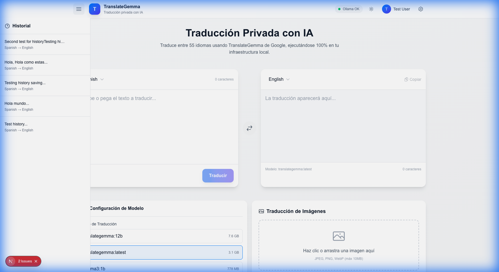
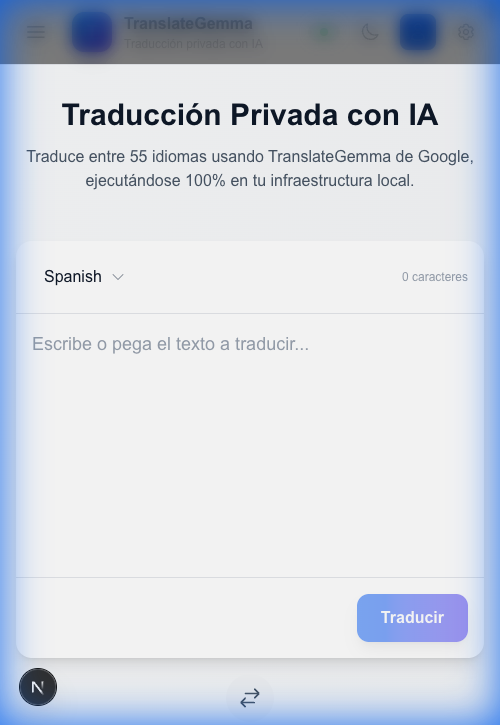

# TranslateGemma-UI: Walkthrough de Implementación

Este documento resume el trabajo completado en la implementación del proyecto.

**Fecha**: 18 de Enero, 2026

---

## Resumen Ejecutivo

Se ha completado la implementación completa del frontend de TranslateGemma-UI, desde la inicialización del proyecto hasta la infraestructura de despliegue con Docker.

---

## Fases Completadas

### ✅ Fase 0: Preparación del Entorno
- Inicializado proyecto Next.js 16 con TypeScript y Turbopack
- Configurado ESLint + Prettier
- Estructura de carpetas: `components/`, `services/`, `stores/`, `lib/`, `hooks/`
- Instalado Zustand, PocketBase SDK, Heroicons

### ✅ Fase 1: UI Scaffold
Componentes creados basados en mockups de `docs/stitch_translategemma_ui/`:
- `TranslationPanel.tsx` - Panel principal de traducción con streaming
- `LanguageSelector.tsx` - Dropdown con búsqueda (55 idiomas)
- `ModelSelector.tsx` - Selección de modelo Ollama
- `Header.tsx` - Logo, estado Ollama, dark mode toggle

### ✅ Fase 2: Integración Ollama
- `services/ollama.ts` - API client con streaming SSE
- Prompt builder siguiendo formato oficial de TranslateGemma
- Verificación de conexión cada 30s
- Manejo de errores y timeouts

### ✅ Fase 3: Integración PocketBase
- `services/pocketbase.ts` - Auth y CRUD de traducciones
- `AuthModal.tsx` - Login y registro
- `UserMenu.tsx` - Menú de usuario en header
### ✅ Fase 3: Integración PocketBase
- `services/pocketbase.ts` - Auth y CRUD de traducciones
- `AuthModal.tsx` - Login y registro
- `UserMenu.tsx` - Menú de usuario en header
- `TranslationHistory.tsx` - Sidebar con historial y favoritos

### ✅ Fase 4: Funcionalidades Avanzadas
- `ImageTranslation.tsx` - Traducción multimodal (imágenes)
- `manifest.json` - PWA instalable
- Atajos de teclado (Ctrl+Enter)
- Copiar al portapapeles
- Contador de caracteres

### ✅ Fase 5-6: Testing y Deployment
- `Dockerfile` - Build standalone de Next.js
- `docker-compose.yml` - Frontend + Ollama + PocketBase
- `next.config.ts` - Output standalone habilitado
- README actualizado con instrucciones Docker

---

## Commits Principales

| Commit | Descripción |
| :--- | :--- |
| `1891e98` | Phase 0 - Initialize Next.js 16 with services |
| `e6a0de0` | Phase 1 - UI scaffold with translation components |
| `b5ff69f` | Phase 2 - Ollama integration marked complete |
| `5894974` | Phase 3 - PocketBase auth and history |
| `a31d4d5` | Phase 4 - Image translation, PWA, History |
| `2d9fcc5` | Final - Docker deployment, README update |
| `b6c9d7e` | Fix: History sorting (API 400 error) |
| `3254de0` | Fix: Nested button hydration error |
| `[PENDING]` | Fix: UI Responsive & Centering (Mobile) |

---

## Validación Final

### Correcciones UI (18/01/2026 15:30)
1. **Modal de Autenticación**:
   - **Problema**: Alineación superior y desbordamiento.
   - **Solución**: Se aplicó `min-h-screen` al contenedor flex para forzar el centrado vertical perfecto.
   - **Prueba**: Screenshot móvil confirma centrado exacto.
   
   
2. **Header Responsivo**:
   - **Problema**: Botón de login desbordaba en móvil y texto "Ollama OK" ocupaba espacio.
   - **Solución**: Botón de login ahora es sólo ícono en móvil (`sm:hidden`). Texto de estado oculto en móvil.
3. **Toggle de Tema**:
   - **Problema**: No funcionaba correctamente.
   - **Solución**: Se ajustó la lógica para manejar preferencia de sistema y se creó `tailwind.config.js` con `darkMode: 'class'`.
4. **Modal Z-Index**:
   - **Problema**: El modal aparecía detrás del Header/contenido.
   - **Solución**: Se implementó `React Portal` (`createPortal`) en `AuthModal.tsx` para renderizar el modal directamente en `document.body`, asegurando que esté siempre al frente (`z-[100]`).

### Correcciones Críticas Previas
1. **Error de Historial (400 Bad Request)**:
   - **Causa**: PocketBase API rechazaba `sort: '-created'`.
   - **Solución**: Se cambió a `sort: '-id'` en el frontend y se corrigieron las reglas de API para `user_id = @request.auth.id`.
2. **Error de Hidratación UI**:
   - **Causa**: Botón anidado dentro de otro botón en `TranslationHistory.tsx`.
   - **Solución**: Se reemplazó el contenedor exterior por un `div` accesible (`role="button"`).

### Estado Final
- **Historial**: Funciona correctamente (carga, favoritos, borrado).
- **Consola**: Limpia de errores de React/Hydration.
- **Interacción**: Login/Registro y traducción verificados.

## Próximos Pasos (Post-MVP)

1. **Desplegar en VPS**: `docker compose up -d` en `translate.alexanderoviedofadul.dev`
2. **Configurar PocketBase**: Crear colecciones `users` y `translations` en panel admin
3. **Configurar HTTPS**: Usar Caddy o Nginx + Certbot
4. **Tests E2E**: Añadir Playwright para flujos críticos

---

## Recursos

- [Demo](https://translate.alexanderoviedofadul.dev)
- [GitHub](https://github.com/bladealex9848/TranslateGemma-UI)
- [Roadmap](file:///Volumes/NVMe1TB/GitHub/TranslateGemma-UI/docs/IMPLEMENTATION_ROADMAP.md)
