# Análisis de Rendimiento: Servidor Ollama Personalizado

Este documento detalla los resultados de las pruebas de rendimiento realizadas contra un **servidor Ollama personalizado** para determinar la configuración óptima de TranslateGemma-UI.

**Fecha**: 18 de Enero, 2026
**Ubicación de Prueba**: Remota

---

## 1. Modelos Disponibles

El servidor expone los siguientes modelos relevantes:
*   `translategemma:12b`: Modelo equilibrado (Google DeepMind).
*   `translategemma:latest`: Etiqueta puntero (Parece corresponder a la variante 4B u optimizada).
*   `gemma3:1b`: Modelo general ultraligero.

---

## 2. Resultados del Benchmark

Pruebas realizadas con traducción Inglés -> Español (Prompt estándar).

| Modelo | Tiempo Promedio (s) | Velocidad (Tokens/s) | Calidad Percibida |
| :--- | :--- | :--- | :--- |
| **`gemma3:1b`** | 1.27s | **26.84 t/s** | Buena (Prompt simple) |
| **`translategemma:latest`** | 1.73s | **17.00 t/s** | Excelente |
| **`translategemma:12b`** | 3.80s | 5.93 t/s | Excelente |

### Gráfico de Velocidad (Tok/s)

```mermaid
gantt
    title Velocidad de Generación (Más largo es mejor)
    dateFormat X
    axisFormat %s
    
    section Modelos
    Gemma3 1B (26.8 t/s)       : 0, 26
    TranslateGemma Latest(17 t/s) : 0, 17
    TranslateGemma 12B (5.9 t/s)  : 0, 6
```



---

## 3. Análisis e Interpretación

### `translategemma:latest` (Ganador para Default) 🏆
Con **17 tokens por segundo**, este modelo ofrece una experiencia de usuario "casi instantánea". Es 3 veces más rápido que la versión 12B. Para una interfaz web interactiva, la latencia es el factor más crítico.
*   **Recomendación**: Usar como `DEFAULT_MODEL`.

### `translategemma:12b`
Con **~6 tokens por segundo**, es notablemente más lento. Aunque la generación es fluida (más rápido de lo que se lee), se siente "pesado" para frases cortas.
*   **Recomendación**: Ofrecer como opción "Modo Alta Precisión" en la configuración de la UI.

### `gemma3:1b`
Sorprendentemente rápido y capaz, pero no está afinado específicamente para traducción (instrucciones complejas podrían fallar).
*   **Recomendación**: Mantener como backup para dispositivos móviles extremos.

---

## 4. Configuración Final Aplicada

Se ha actualizado el archivo `.env` del proyecto con estos valores óptimos:

```env
OLLAMA_HOST=https://ollama.alexanderoviedofadul.dev/
OLLAMA_MODEL=translategemma:latest
OLLAMA_TIMEOUT=60  # Reducido de 120s debido a la alta velocidad detectada
```

---

## 5. Conclusiones

El servidor personalizado está **perfectamente capacitado** para soportar el tráfico de TranslateGemma-UI. La latencia de red es mínima y el tiempo de inferencia es competitivo con APIs comerciales.
