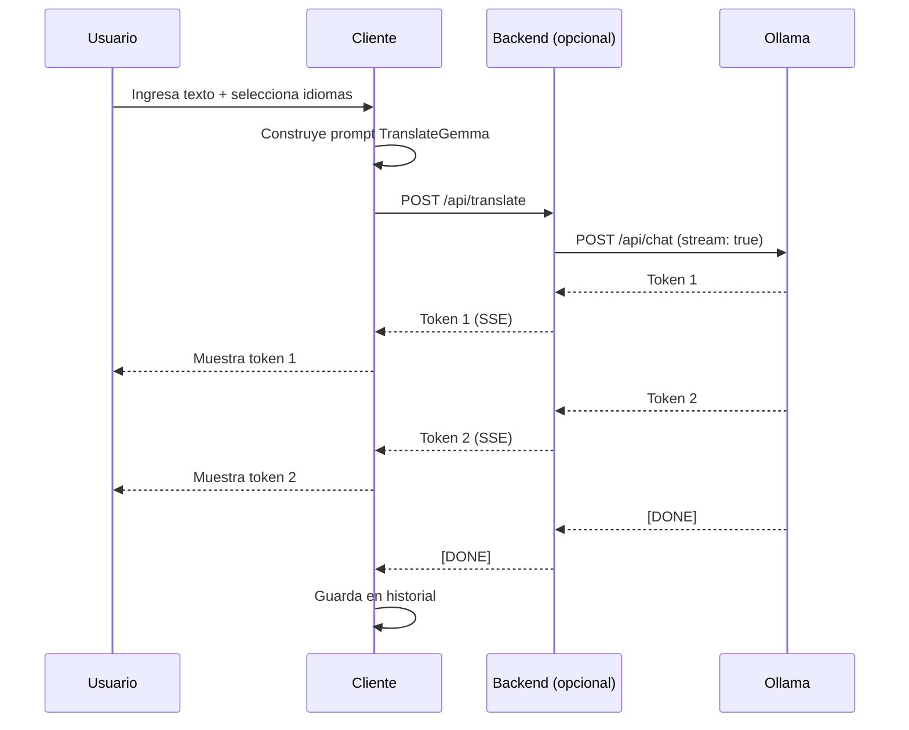

# Prompt para Arquitecto de Software: Integración TranslateGemma + Ollama

Este documento contiene un prompt completo y detallado para entregar a un experto arquitecto de software que planificará la arquitectura e integración de la aplicación de traducción con TranslateGemma.

---

## Prompt Completo

```
# Brief de Arquitectura: Sistema de Traducción con TranslateGemma y Ollama

## Contexto del Proyecto

Necesito diseñar la arquitectura de un sistema de traducción que utiliza los modelos TranslateGemma de Google ejecutados localmente a través de Ollama. El objetivo es crear una aplicación web robusta, escalable y fácil de mantener.

---

## Stack Tecnológico Base

### Backend de IA
- **Ollama**: Servidor local para ejecutar modelos LLM
- **Modelos**: TranslateGemma 4B, 12B, 27B
- **API**: REST API de Ollama en `http://localhost:11434`

### Requisitos del Sistema
- Soporte para 55 idiomas
- Traducción de texto y de imágenes (multimodal)
- Contexto de hasta 128K tokens
- Respuestas en streaming

---

## Requisitos Funcionales

### RF01: Traducción de Texto
- Entrada de texto hasta 128K tokens
- Selección de idioma origen y destino
- Respuesta en streaming para UX fluida
- Detección automática de idioma (opcional)

### RF02: Traducción de Imágenes
- Subida de imágenes (JPEG, PNG, WebP)
- Procesamiento multimodal con TranslateGemma
- Extracción y traducción de texto en imágenes

### RF03: Gestión de Modelos
- Listar modelos disponibles en Ollama
- Permitir selección de modelo por usuario
- Mostrar estado de descarga de modelos

### RF04: Historial
- Almacenar traducciones anteriores
- Búsqueda en historial
- Exportar historial

### RF05: Configuración
- Configurar URL del servidor Ollama
- Preferencias de idiomas
- Tema visual

---

## Requisitos No Funcionales

### RNF01: Rendimiento
- Tiempo de primera respuesta < 2 segundos
- Streaming de tokens para percepción de velocidad
- Manejo eficiente de textos largos

### RNF02: Disponibilidad
- Detección de estado del servidor Ollama
- Manejo graceful de desconexiones
- Reintentos automáticos

### RNF03: Seguridad
- Ejecución local (sin envío de datos a terceros)
- Sanitización de inputs
- Sin exposición de endpoints sensibles

### RNF04: Escalabilidad
- Arquitectura que permita múltiples backends
- Fácil adición de nuevos modelos

---

## Arquitectura Propuesta

### Opción A: Single Page Application + Backend Ligero

```
┌─────────────────────────────────────────────────────────────────┐
│                         CLIENTE                                 │
│  ┌───────────────────────────────────────────────────────────┐  │
│  │                    SPA (React/Vue/Svelte)                 │  │
│  │  - UI de traducción                                       │  │
│  │  - Estado local (historial, preferencias)                 │  │
│  │  - Conexión WebSocket/SSE para streaming                  │  │
│  └───────────────────────────────────────────────────────────┘  │
└─────────────────────────────────────────────────────────────────┘
                              │
                              ▼
┌─────────────────────────────────────────────────────────────────┐
│                    BACKEND (Opcional)                           │
│  ┌───────────────────────────────────────────────────────────┐  │
│  │              API Gateway / Proxy (FastAPI/Express)        │  │
│  │  - Routing a Ollama                                       │  │
│  │  - Validación de requests                                 │  │
│  │  - Logging y métricas                                     │  │
│  │  - Manejo de archivos (imágenes)                          │  │
│  └───────────────────────────────────────────────────────────┘  │
└─────────────────────────────────────────────────────────────────┘
                              │
                              ▼
┌─────────────────────────────────────────────────────────────────┐
│                    OLLAMA SERVER                                │
│  ┌───────────────────────────────────────────────────────────┐  │
│  │              localhost:11434                               │  │
│  │  - TranslateGemma:4b                                      │  │
│  │  - TranslateGemma:12b                                     │  │
│  │  - TranslateGemma:27b                                     │  │
│  └───────────────────────────────────────────────────────────┘  │
└─────────────────────────────────────────────────────────────────┘
```

### Opción B: Cliente Directo a Ollama (Sin Backend)

```
┌─────────────────────────────────────────────────────────────────┐
│                         CLIENTE                                 │
│  ┌───────────────────────────────────────────────────────────┐  │
│  │                    SPA (React/Vue/Svelte)                 │  │
│  │  - UI de traducción                                       │  │
│  │  - Conexión directa a Ollama API                         │  │
│  │  - LocalStorage para historial                            │  │
│  └───────────────────────────────────────────────────────────┘  │
└─────────────────────────────────────────────────────────────────┘
                              │
                              ▼
┌─────────────────────────────────────────────────────────────────┐
│                    OLLAMA SERVER                                │
│              localhost:11434                                     │
│              (CORS configurado)                                  │
└─────────────────────────────────────────────────────────────────┘
```

---

## Integración con Ollama API

### Endpoints Principales

#### Listar Modelos
```bash
GET http://localhost:11434/api/tags
```

#### Chat (Traducción)
```bash
POST http://localhost:11434/api/chat
Content-Type: application/json

{
  "model": "translategemma:12b",
  "messages": [
    {
      "role": "user",
      "content": "You are a professional English (en) to Spanish (es) translator..."
    }
  ],
  "stream": true
}
```

#### Con Imagen (Multimodal)
```bash
POST http://localhost:11434/api/chat
Content-Type: application/json

{
  "model": "translategemma:12b",
  "messages": [
    {
      "role": "user",
      "content": "Translate the text in this image to Spanish",
      "images": ["base64_encoded_image"]
    }
  ]
}
```

---

## Flujo de Traducción



---

## Estructura de Proyecto Propuesta

```
translategemma-ui/
├── frontend/                 # SPA
│   ├── src/
│   │   ├── components/       # Componentes UI
│   │   ├── services/         # API calls
│   │   ├── stores/           # Estado global
│   │   ├── utils/            # Utilidades
│   │   └── App.tsx
│   ├── package.json
│   └── vite.config.ts
│
├── backend/ (opcional)       # API Gateway
│   ├── src/
│   │   ├── routes/           # Endpoints
│   │   ├── services/         # Lógica de negocio
│   │   └── main.py
│   ├── requirements.txt
│   └── Dockerfile
│
├── docs/                     # Documentación
│   ├── translategemma/
│   └── prompts/
│
├── .env                      # Variables de entorno
├── .env.example
├── docker-compose.yml        # Orquestación
└── README.md
```

---

## Variables de Entorno

```env
# Ollama
OLLAMA_HOST=http://localhost:11434
OLLAMA_DEFAULT_MODEL=translategemma:12b

# Backend (si aplica)
API_PORT=3000
API_HOST=0.0.0.0
CORS_ORIGINS=http://localhost:5173

# Frontend
VITE_API_URL=http://localhost:3000
VITE_OLLAMA_DIRECT=false
```

---

## Manejo de Errores

### Escenarios de Error

| Error | Causa | Manejo |
|-------|-------|--------|
| Ollama no disponible | Servidor apagado | Mostrar estado, instrucciones para iniciar |
| Modelo no descargado | No existe localmente | Ofrecer descarga desde UI |
| Timeout | Texto muy largo | Dividir en chunks, reintentar |
| Idioma no soportado | Código inválido | Validar contra lista de 55 idiomas |

---

## Consideraciones de Despliegue

### Local (Desarrollo)
```bash
# Terminal 1: Ollama
ollama serve

# Terminal 2: Backend (opcional)
cd backend && uvicorn main:app --reload

# Terminal 3: Frontend
cd frontend && npm run dev
```

### Docker Compose
```yaml
version: '3.8'
services:
  ollama:
    image: ollama/ollama
    ports:
      - "11434:11434"
    volumes:
      - ollama_data:/root/.ollama

  backend:
    build: ./backend
    ports:
      - "3000:3000"
    environment:
      - OLLAMA_HOST=http://ollama:11434
    depends_on:
      - ollama

  frontend:
    build: ./frontend
    ports:
      - "5173:80"
    depends_on:
      - backend
```

---

## Preguntas de Arquitectura a Resolver

1. **¿Backend o conexión directa?**
   - Sin backend: Más simple, menos latencia
   - Con backend: Más control, logging, posibilidad de agregar features

2. **¿Framework frontend?**
   - React: Ecosistema más grande
   - Vue: Más simple, buena DX
   - Svelte: Mejor rendimiento, menos bundle

3. **¿Dónde almacenar historial?**
   - LocalStorage: Simple, privado, límite de tamaño
   - IndexedDB: Más capacidad, más complejo
   - SQLite en backend: Persistente, requiere backend

4. **¿Cómo manejar imágenes grandes?**
   - Compresión en cliente antes de enviar
   - Límite de tamaño de archivo
   - Procesamiento en chunks

5. **¿Soporte offline?**
   - PWA con Service Worker
   - Cache de UI, pero traducción requiere Ollama

---

## Entregables Esperados

1. **Documento de Arquitectura (SAD)**
2. **Diagrama de componentes detallado**
3. **Especificación de API**
4. **Plan de implementación por fases**
5. **Estimación de esfuerzo**
```

---

## Recursos para el Arquitecto

### Documentación de Referencia
- [Ollama API Docs](https://github.com/ollama/ollama/blob/main/docs/api.md)
- [TranslateGemma Technical Report](https://arxiv.org/abs/2601.09012)
- Documentación en `docs/translategemma/`

### Consideraciones Especiales

1. **CORS en Ollama**: Por defecto Ollama permite localhost. Para otros orígenes, configurar `OLLAMA_ORIGINS`.

2. **Streaming**: La API de Ollama soporta streaming nativo. Esencial para buena UX.

3. **Modelos grandes**: El modelo 27B requiere ~24GB VRAM. Considerar fallback a modelos menores.

4. **Rate limiting**: Ollama procesa una request a la vez. Implementar cola si hay múltiples usuarios.
